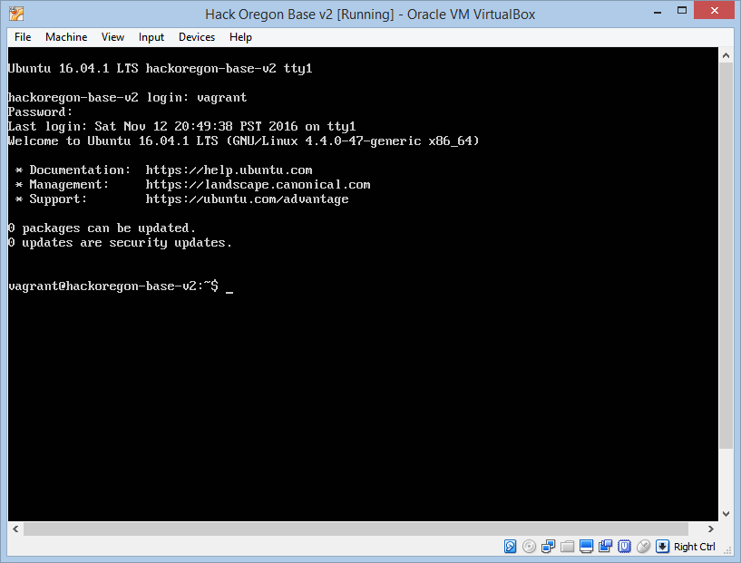

Using the Hack Oregon Base v2 VirtualBox OVA
================
M. Edward (Ed) Borasky <znmeb@znmeb.net> and Scott Lewis <slewis@hackoregon.org>

Bugs? Feature requests? Unclear documentation?
----------------------------------------------

File an issue at <https://github.com/hackoregon/getting-started/issues/new>.

System requirements
-------------------

1.  As always, reliable wall power and internet connectivity!
2.  A 64-bit host system, preferably with virtualization hardware. This is unlikely to work on a 32-bit host even though there are claims that it will. It's just not worth the hassle.
3.  VirtualBox 5.0 or later.

Obtaining, Importing, and Configuring the Hack Oregon Base v2.ova
--------------------------------------

1.  [Download and Install VirtualBox 5.0 or later](https://www.virtualbox.org/wiki/Downloads).
2.  Download the .ova file - it's available [here in our Google Drive repository](https://drive.google.com/drive/folders/0B2VTjTSmFU2lUW90dFUtZVlLZjA). The name is `Hack Oregon Base v2.ova`.  It's ~2GB in size, so if you can get it from someone directly (via thumb drive) then that will  be faster and use less bandwidth.  Please ask around before you download it directly.  This .ova file has an entire environment already installed on it (e.g. Python Mini-Conda, Jupyter Notebook and various Python libraries).  
3.  Start VirtualBox installed in step 1. In the `File` menu, select `Import Appliance`. Browse to the downloaded .ova file from step 2 and select 'Next' and then `Import`.  This will take several minutes to complete the import.  When complete it will look something like this 
4.  Select the `Hack Oregon Base v2` virtual machine in Virtual Box and select the green `Start` arrow.  VirtualBox will open a separate window for this vm and once visible the vm will take some time to start producing text output as it starts.
5.  Once it appears, at the login prompt, log in as `vagrant`, password `ORturkeyeggs`.

6.  The box ships with a publicly-known password, `ORturkeyeggs`, for the `vagrant` account. For personal security you should change the password! To do so, at the prompt enter `passwd`.

        $ passwd
        Changing password for vagrant.
        (current) UNIX password: 
        Enter new UNIX password: 
        Retype new UNIX password: 
        passwd: password updated successfully

7.  To configure postgressql, enter

        cd getting-started/datascience/linux-laptop-setup
        git checkout master
        git pull
        ./configure-postgresql

    `git pull` updates the `getting-started` repository to the latest release and `./configure-postgresql` configures the PostgreSQL database.

    First, you will need to set the *PostgreSQL* password for the PostgreSQL `vagrant` superuser. The script will prompt you. Don't use a colon (':') in the password. The configuration file in the next step uses colon as a separator. If you mis-type one of the password entries, just run the script again.

    Second, you will be put into and editor to edit the file `~/.pgpass`.  You should replace the string 'password' at the top of the file with the password you set above and save your changes by entering ':wq' to write your changes and quit.   Once created, this file allows you to connect to the `vagrant` database as the `vagrant` user in a Jupyter notebook without exposing the database password!

Using the configured .ova for Jupyter Notebook Analysis
------------------------

1.  Open a terminal on the host system.
2.  If the virtual machine is powered off, start it with the green arrow.
3.  Enter `ssh vagrant@localhost -p 2222`. You will be asked for the new password you defined above.
4.  Enter `activate-data-science`.  This starts an environment that allows you to run jupyter notebook and other
tools setup for Hack Oregon data science work.
5.  Enter `jupyternb`. As output you should see

        [I 16:41:20.615 NotebookApp] [nb_conda_kernels] enabled, 2 kernels found
        [I 16:41:20.621 NotebookApp] Writing notebook server cookie secret to /run/user/1000/jupyter/notebook_cookie_secret
        [I 16:41:51.427 NotebookApp] [nb_conda] enabled
        [I 16:41:51.681 NotebookApp] ✓ nbpresent HTML export ENABLED
        [W 16:41:51.682 NotebookApp] ✗ nbpresent PDF export DISABLED: No module named 'nbbrowserpdf'
        [I 16:41:51.843 NotebookApp] [nb_anacondacloud] enabled
        [I 16:41:51.876 NotebookApp] Serving notebooks from local directory: /home/vagrant
        [I 16:41:51.877 NotebookApp] 0 active kernels 
        [I 16:41:51.878 NotebookApp] The Jupyter Notebook is running at: http://0.0.0.0:8888/
        [I 16:41:51.878 NotebookApp] Use Control-C to stop this server and shut down all kernels (twice to skip confirmation).

5.  On the host (your computer rather than the virtual machine), browse to <http://localhost:7777/tree>. You'll be in the Hack Oregon Jupyter notebook environment!
6.  In the Jupyter file tree tab, go into `getting-started/datascience/linux-laptop-setup`. Click the link on the notebook `psycopg2_test.ipynb`. When the notebook tab opens, select `Run All` in the `Cell` menu. If the system is configured correctly there will be no errors.  

OVA Shutdown 
-------------------

1.  Close all/any Jupyter Notebook browser tabs to make sure you have saved your work.
2.  Stop the Jupyter notebook server by typing `Control-C` twice in the vm terminal where the jupyternb server is running.
3.  Deactivate the environment by entering `deactivate-data-science`.
4.  Enter `sudo shutdown -h now` to shut down the virtual machine. You can close the host terminal.
