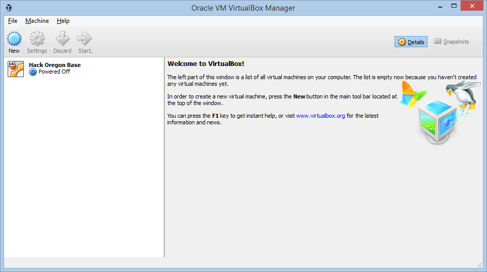
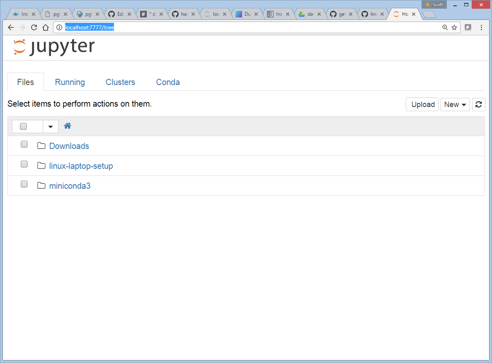
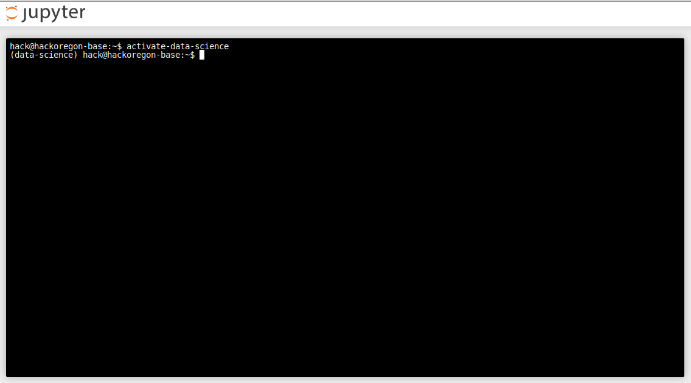

These are the instructions for installing and using the Hack Oregon Base instance (HackOregonBase.ova file) to install and use a python interpreter (miniconda), jupyter notebook, and a postgres server.  All three of these have already been installed into the HackOregonBase.ova (Open Virtualization Archive).

To use the Hack Oregon Base virtual box, it's necessary to first install the Virtual Box software on your operating system.   

1. [Download and install the appropriate version of VirtualBox](https://www.virtualbox.org/wiki/Downloads)

2. Download the Hack Oregon Base OVA file.   This file is ~4gb in size and is available via Google Drive [here](https://drive.google.com/open?id=0B2VTjTSmFU2lWnJUQTR3T3NQdTg).  Also [this is the directory above the HackOregonBase.ova file](https://drive.google.com/drive/folders/0BwX4aOC4pmAtZXRMUGdDeTVwd0E?usp=sharing)

Note that if possible, it would be best to get the HackOregonBase.ova file off of a thumb drive or some other non-network source, as it will take a very long time to download on slow or congested networks.

3. Start Oracle Virtual Box application.   

4. Choose File->Import Appliance... menu.   Navigate to where the HackOregonBase.ova was downloaded to and import it.

5. Once complete, the following should result



6.  Select the Hack Oregon Base box, and click on the Start button.  This will open a separate window, start the Ubuntu OS, and eventually produce a unix login prompt.

7. Login with 

    username: hack 
    
    password: ORturkeyeggs

## To Start Jupyter Notebook

    hack@hackoregon-base:~$  activate-data-science
    (data science) hack@hackoregon-base:~$  jupyter notebook --ip 0.0.0.0 --no-browser

Then using your web broswer go to: http://localhost:7777/tree

You should then see the jupyter page



## Opening a terminal in the virtual machine from the browser:
Once you've connected in the browser, you can open a terminal window in the virtual machine as a browser tab. Pull down the "New" drop-down menu at the upper right and select "Terminal". A browser tab will open up with a terminal.



## Root access:
If for any reason you need "root" access, type `sudo` followed by the command that must run as root. You'll have to enter the password for the "hack" account.

## Changing the "hack" account password:
Since the password for the "hack" account is publicly known, it's a good idea to change it to something only you know. To do that, type `passwd` and follow instructions.

```
hack@hackoregon-base:~$ passwd
Changing password for hack.
(current) UNIX password: 
Enter new UNIX password: 
Retype new UNIX password: 
passwd: password updated successfully
hack@hackoregon-base:~$ 
```
